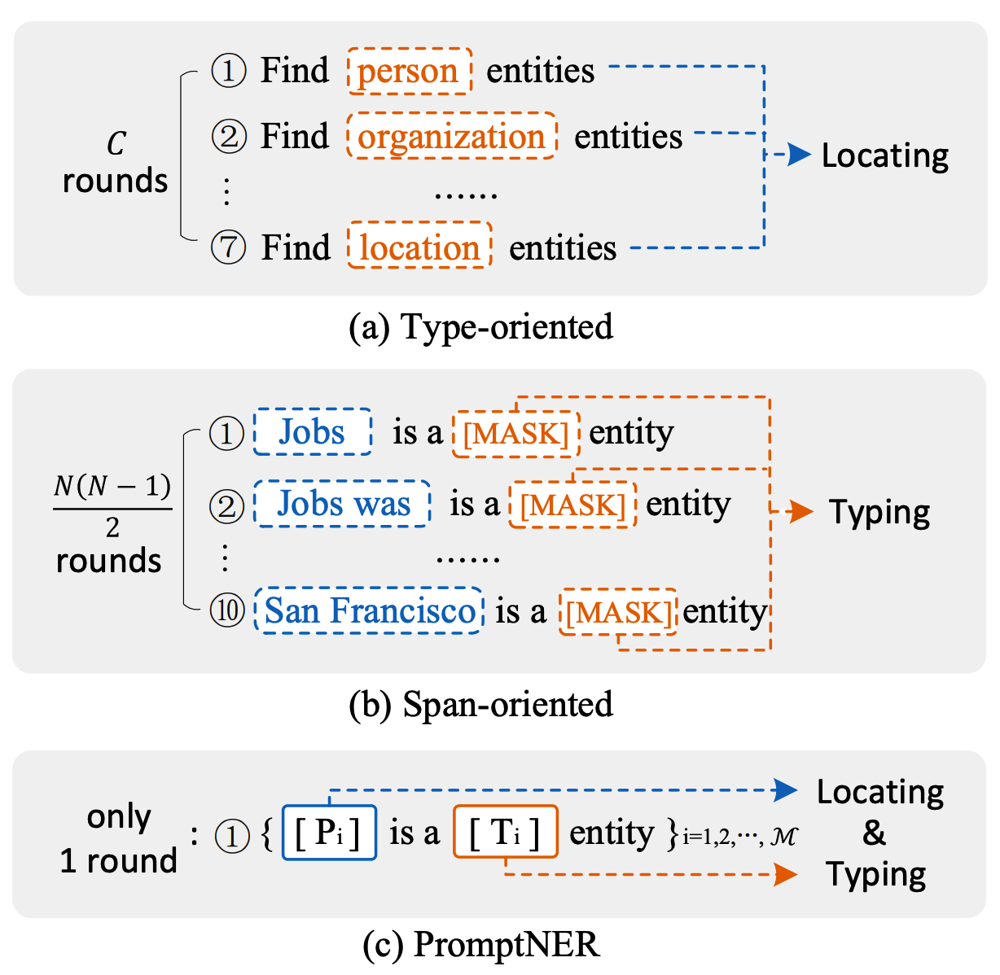
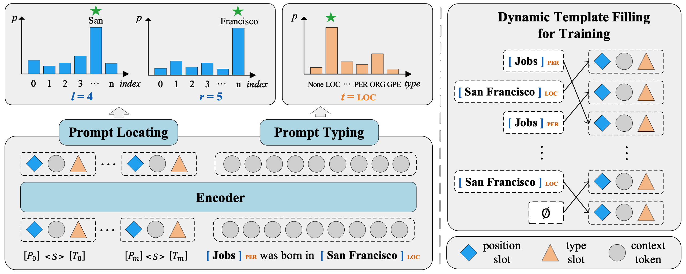

# PromptNER

Code for [PromptNER: Prompt Locating and Typing for Named Entity Recognition](https://arxiv.org/abs/2305.17104v1), accepted at ACL 2023.

<p float="left">
  
  
</p>

The left figure show a comparison of the type-oriented (a) and span-oriented (b) prompt learning with the proposed PromptNER (c). C, N and M denote the number of
entity types, words and prompts, respectively; The right figure shows an overview of PromptNER. The left part describes the model’s inference process and the right part describes the dynamic template filling mechanism during training.

## Setup

```bash
conda create -n promptner python=3.8
conda activate promptner
pip install -r requirements.txt
```

## Usage

This repository is under construction. We will further detail the usage of the code and the data.

### Data

For the data, please refer to [data/README.md](data/README.md).

### Training

1. Supervised Setting:

+ PromptNER[BERT] on ACE2004:

```
python prompt4ner.py train --config configs/bert/ace2004.conf
```

+ PromptNER[RoBERTa] on ACE2005:

```
python prompt4ner.py train --config configs/roberta/ace2005.conf
```

2. Low-resource Setting:

+ Wiki Warmup Pretrain:
<a name="wiki-warmup-pretrain"></a>

```
python prompt4ner.py train --config configs/few_shot/wiki_pretrain/pretrain.conf
```

+ In-domain Setting:

```
python prompt4ner.py train --config configs/few_shot/in_domain/conll2003_sampling.conf
```

+ Cross-domain Setting:

First train PromptNER on source domain (CoNLL 2003) based on the pre-trained model from [Wiki Warmup Pretrain](#wiki-warmup-pretrain):

```
python prompt4ner.py train  --config configs/few_shot/cross_domain/source.conf
```

Then train PromptNER on target domain (MIT Movie) using the model from the previous step: 

```
python prompt4ner.py train --config configs/few_shot/cross_domain/mm.conf
```

### Evaluation

For evaluation, please first replace the `model_path@configs/eval.conf` with the path of the trained model. Then run:

```
python prompt4ner.py eval --config configs/eval.conf
```